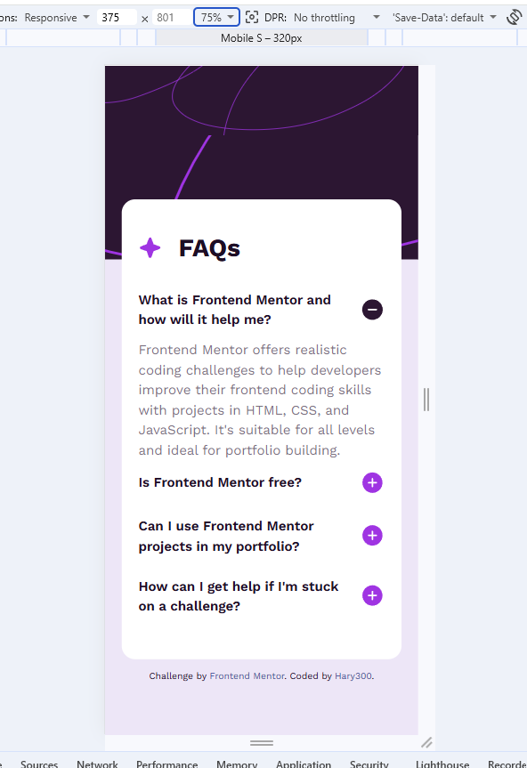
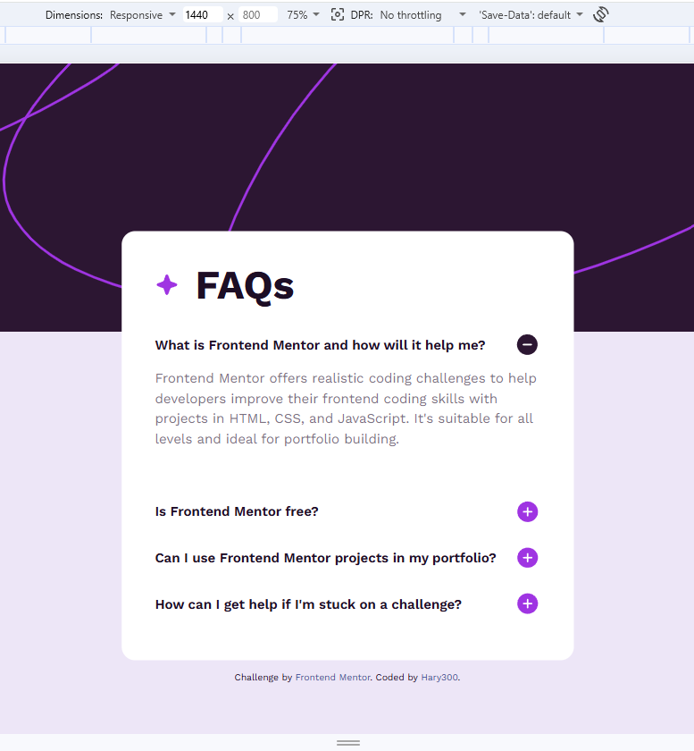

# Frontend Mentor - FAQ accordion

# Frontend Mentor - FAQ accordion solution

This is a solution to the [FAQ accordion challenge on Frontend Mentor](https://www.frontendmentor.io/challenges/faq-accordion-wyfFdeBwBz).

## Table of contents

- [Overview](#overview)
  - [The challenge](#the-challenge)
  - [Screenshot](#screenshot)
  - [Links](#links)
- [My process](#my-process)
  - [Built with](#built-with)
  - [What I learned](#what-i-learned)

## Overview

### The challenge

Users should be able to:

- Hide/Show the answer to a question when the question is clicked
- Navigate the questions and hide/show answers using keyboard navigation alone
- View the optimal layout for the interface depending on their device's screen size
- See hover and focus states for all interactive elements on the page

### Screenshot

### Links

- Solution URL: (https://github.com/Hary300/Frontendmentor-Project-13-FAQ-Accordion)
- Live Site URL: (https://your-live-site-url.com)

## My process

### Built with

- Semantic HTML5 markup
- CSS custom properties
- Tailwind
- Flexbox
- CSS Grid
- Mobile-first workflow

### What I learned

# Front-end Style Guide

## Layout

The designs were created to the following widths:

- Mobile: 375px
- Desktop: 1440px

> 💡 These are just the design sizes. Ensure content is responsive and meets WCAG requirements by testing the full range of screen sizes from 320px to large screens.

## Colors

- White: hsl(0, 100%, 100%)
- Purple 100: hsl(275, 100%, 97%)
- Purple 600: hsl(292, 16%, 49%)
- Purple 950: hsl(292, 42%, 14%)

## Typography

### Body Copy

- Font size (paragraphs): 16px

### Font

- Family: [Work Sans](https://fonts.google.com/specimen/Work+Sans)
- Weights: 400, 600, 700
